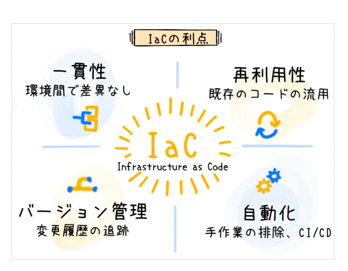
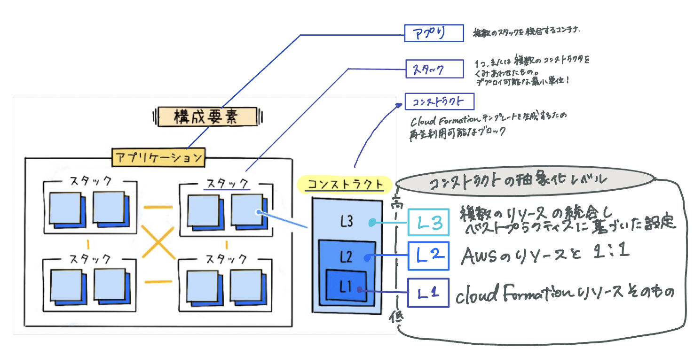

# [AWS Cloud Development Kit (CDK)](https://aws.amazon.com/jp/cdk/)

【AWS CloudFormationクラウドインフラストラクチャを**コードで定義し、それをプロビジョニングするためのオープンソースのソフトウェア開発フレームワーク**】

## 概要

- AWSの環境を 一般のプログラミング言語で記述できるツールキット
  - AWS CDK を使用すると、**AWS の各種サービス (例えばEC2、S3、RDS など) のリソースをコードで定義**でき、クラウドインフラを効率的に設計・プロビジョニングできます。

- [**IaC の原則**](https://aws.amazon.com/jp/builders-flash/202309/awsgeek-aws-cdk/#:~:text=AWS%20CDK%20%E3%81%AE%E6%A7%8B%E6%88%90%E8%A6%81%E7%B4%A0,%E3%81%AE%E7%B5%84%E3%81%BF%E5%90%88%E3%82%8F%E3%81%9B%E3%82%92%E8%A1%A8%E3%81%97%E3%81%BE%E3%81%99%E3%80%82)に基づき、開発者はサポートされるプログラミング言語から好きなものを選択し、クラウドリソースを定義できる
  - 言語は、TypeScript、JavaScript、Python,Java,C#/.Net,Goをサポート

  
IaCの原則について

  [**IaC の原則(Infrastructure as Code)**](https://aws.amazon.com/jp/builders-flash/202309/awsgeek-aws-cdk/#:~:text=AWS%20CDK%20%E3%81%AE%E6%A7%8B%E6%88%90%E8%A6%81%E7%B4%A0,%E3%81%AE%E7%B5%84%E3%81%BF%E5%90%88%E3%82%8F%E3%81%9B%E3%82%92%E8%A1%A8%E3%81%97%E3%81%BE%E3%81%99%E3%80%82)

 

  >手動のプロセスや設定の代わりに、**コードを使用してインフラストラクチャの管理とプロビジョニングを行うこと**. 
  **インフラの構成や設定をコード化**するため、手動設定によるエラーを減らし、一貫性を確保

  [利点]

- **一貫性** 
  コードによるインフラの管理は、設定ミスやヒューマンエラーのリスクを減らし、環境の一貫性を保持します。
- **再利用性** 
  コード化されたインフラは再利用可能で、新しい環境のセットアップ時間を短縮します。
- **バージョン管理** 
  インフラの設定はコードとしてバージョン管理システムに保存され、変更履歴を追跡できます。
- **自動化** 
  デプロイに関連する作業の自動化が容易になり、効率性と速度が向上します。

- AWS CDK の中心的な概念は「コンストラクト」

## 主要な構成要素について

主に以下の 3 つのレイヤーに分けられる。

- [**コンストラクト (Construct)**](https://docs.aws.amazon.com/ja_jp/cdk/v2/guide/constructs.html)
- **スタック (Stack)**
- **アプリケーション (App)**

### 要素①[**コンストラクト (Construct)**](https://docs.aws.amazon.com/ja_jp/cdk/v2/guide/constructs.html)

- AWS の各種サービスや機能をコード上で定義し、CloudFormation テンプレートを生成するための再利用可能なブロック

#### <コンストラクトの抽象化レベル>

| コンストラクトレイヤー | 特徴 |
|---------------------|-----|
| L1 コンストラクト | 特定の CloudFormation リソース (例えば、S3 バケットや EC2 インスタンスなど) に 1 対 1 で対応するコンストラクトです。 |
| L2 コンストラクト | L1 コンストラクトより高度な抽象化を提供し、一般的な AWS リソース設定やベストプラクティスを組み込むことができます。複雑なリソース設定をより簡単に記述したり、既知のベストプラクティスを容易に適用したりすることが可能になります。 |
| L3 コンストラクト | 複数の L2 コンストラクトを組み合わせて、特定のアプリケーションやタスクのパターンを実現する高レベルな抽象化を提供します。複雑なセットアップを簡潔なコードで記述することが可能になり、よくある AWS のアーキテクチャパターンを効率的に実装することができます。 |

## [開発フロー](https://aws.amazon.com/jp/builders-flash/202309/awsgeek-aws-cdk/#:~:text=AWS%20CDK%20%E3%81%AE%E6%A7%8B%E6%88%90%E8%A6%81%E7%B4%A0,%E3%81%AE%E7%B5%84%E3%81%BF%E5%90%88%E3%82%8F%E3%81%9B%E3%82%92%E8%A1%A8%E3%81%97%E3%81%BE%E3%81%99%E3%80%82)
