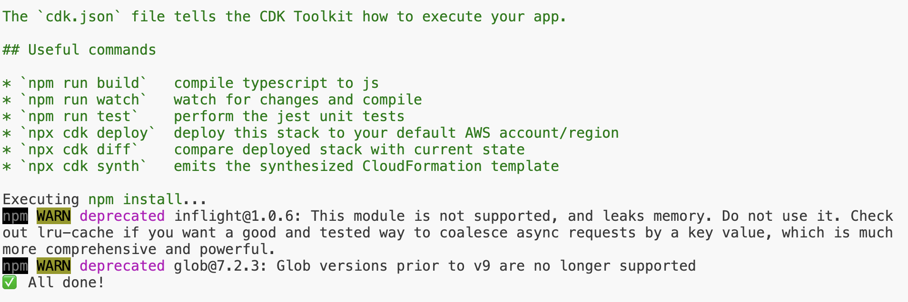

# 事前準備: 環境構築

## [CDK init: CDKの開始準備](https://docs.aws.amazon.com/ja_jp/cdk/v2/guide/getting_started.html#getting_started_install)

- はじめにCDKのインストールを行う。作業ディレクトリで以下を実行。

```cli
npm install -g aws-cdk
```

→ バージョンの確認

```cli
cdk --version
```

## [CDKアプリの初回作成](https://docs.aws.amazon.com/ja_jp/cdk/v2/guide/hello_world.html#hello_world_tutorial_create_app)

⚠️ 独自のローカルモジュールの依存関係を持つ独自のディレクトリにある必要がある。
開発マシンで、新しいディレクトリを作成する。

```cli
mkdir hello-cdk
cd hello-cdk
```

- 次に、新しいディレクトリから、 cdk init コマンドを使用してアプリケーションを初期化.
- `--language` オプションを使用して、appテンプレートと任意のプログラミング言語を指定する

```cli
cdk init app --language typescript
```

 `All done!`が出たら成功！



### ディレクトリと役割

```cli
hello-cdk/
├── bin/ ⭐️ エントリポイント。定義されたスタックをロード
├── lib/ ⭐️メインスタック定義される場所
├── node_modules/
├── test/
├── .gitignore
├── .npmignore
├── cdk.json ⚪️ツールキットにアプリの実行方法を伝える
├── jest.config.js
├── package-lock.json
├── package.json　　⚪️ビルド スクリプトなどの情報が含まれてる
├── README.md
├── tsconfig.json ⚪️プロジェクトのTypescript設定
```
