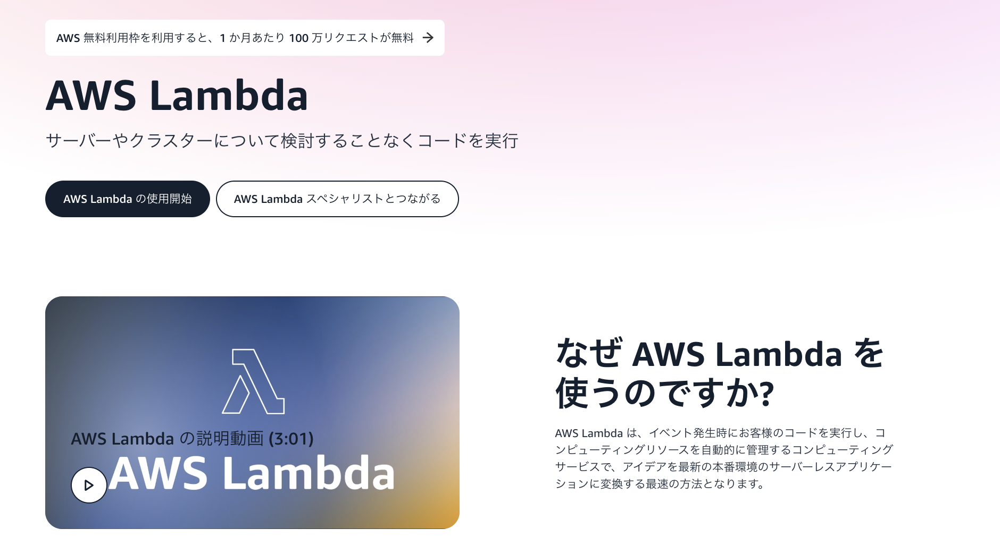

# [AWS Lambda](https://aws.amazon.com/jp/lambda/)

## 概要

【**サーバーレスでイベント駆動型のコンピューティングサービス**】

→ [動画](https://youtu.be/qlkr0h9JQ6U)

- **サーバーのプロビジョニング/管理なし**でプログラムを実行できるサー
ビス 
= EC2インスタンスなどのサーバーを準備しなくてもコードを実行できる 
= [**サーバーレスアプリケーション**](https://aws.amazon.com/jp/serverless/)

サーバーレスアプリケーション

サーバーを管理することなく、コードの実行、データの管理、アプリケーションの統合を行うもの。

lambdaのほか、サーバーレスアプリケーションには以下のようなものがある
<https://aws.amazon.com/jp/serverless/>

要チェック

</>

## [料金体系](https://aws.amazon.com/jp/lambda/pricing/)

- リクエストベース
  - 実行回数と実行時間  

## 関連

### Lambda@Edge

- Amazon CloudFrontの機能で、アプリケーションのユーザーに近いロケーションでコードを実行するもの。
